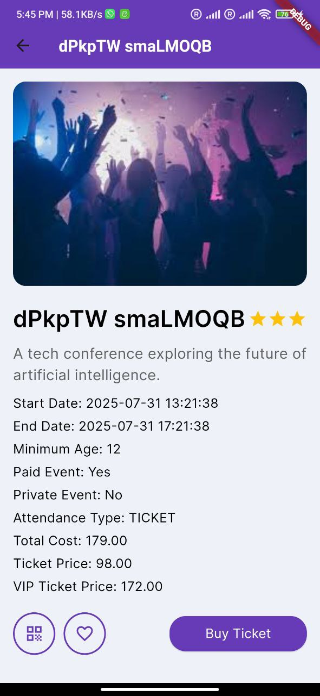
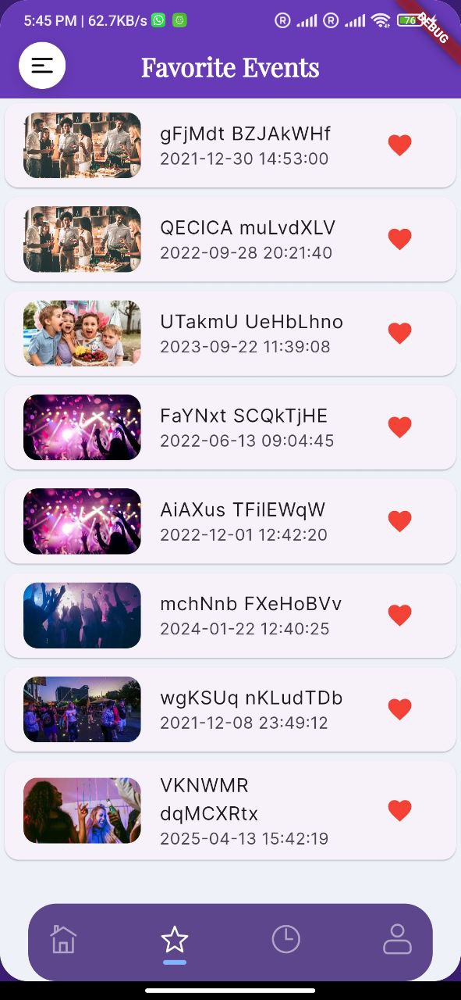
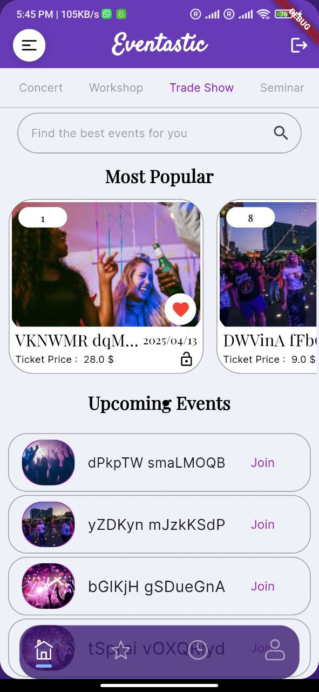
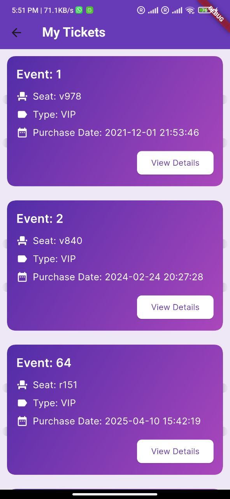
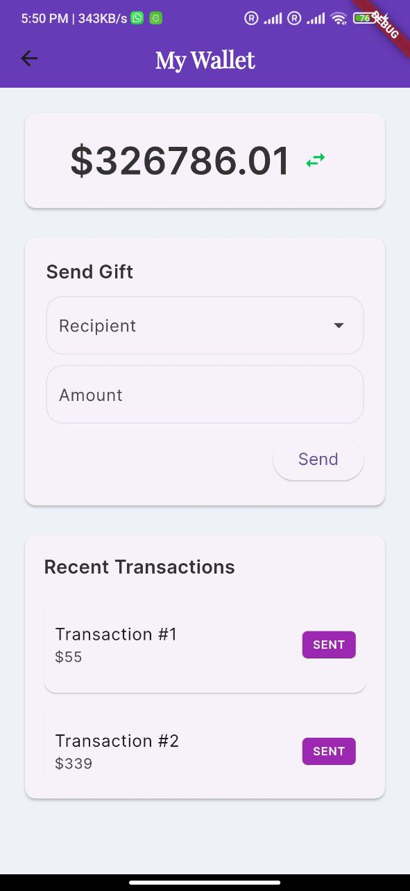
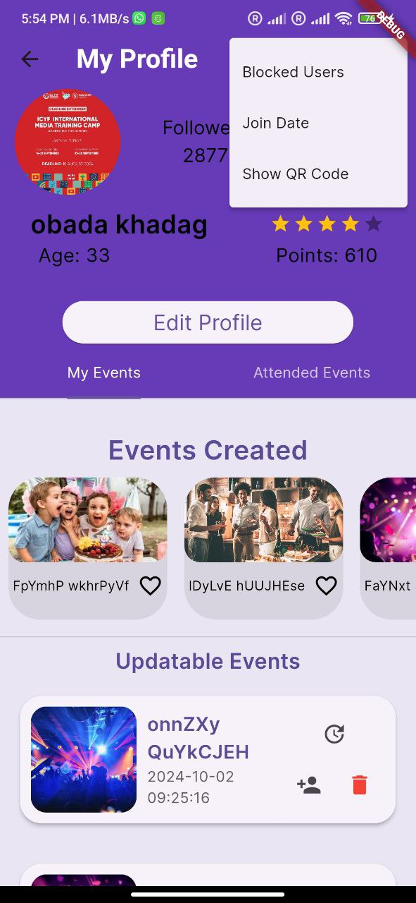
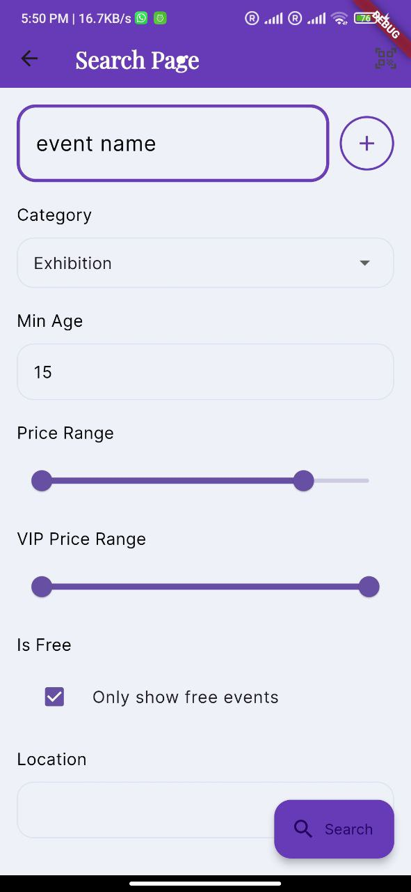
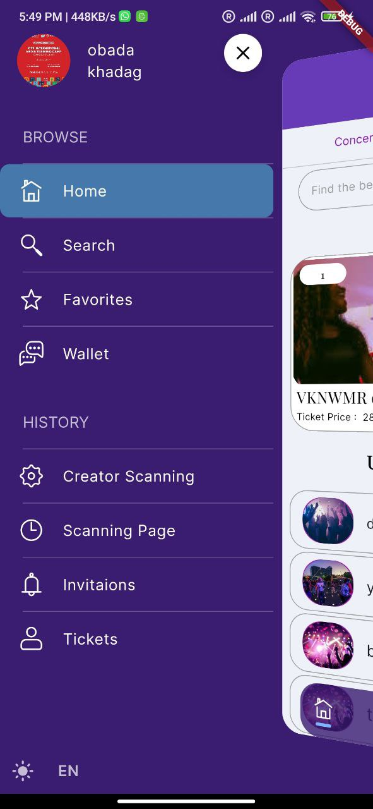

# 📱 Eventastic 

A modern **Flutter mobile application** for **Event Management**.  
This repo contains only the **Flutter front-end** (no Laravel backend).  

---

## 📸 App Screenshots

<p align="center">
  
  
  
</p>
<p align="center">
  
  
  
</p>
<p align="center">
  
  
  
</p>

---

## ✨ Features  

- 📅 Create, manage, and view events  
- 🗓 Interactive event calendar (Table Calendar)  
- 👥 User authentication (Firebase Auth + Google Sign-In)  
- 📦 Local storage with `shared_preferences` and `get_storage`  
- 🖼️ Media support (image picker, file picker, QR code scanner)  
- 🎟️ Ticket widgets and barcode generation  
- 🔔 Notifications-ready and Firebase core integration  
- 🎨 Custom fonts, themes, and animations (Rive, SVGs, rating bars)  
- 📱 Runs on **Android** and **iOS**  

---

## 📁 Project Structure  

lib/
├── components/ # Reusable UI parts
├── controllers/ # State management (GetX, Provider)
├── CreateEvent/ # Screens for event creation
├── generated/ # Auto-generated files
├── models/ # Data models
├── PROFILE/ # Profile-related screens
├── screens/ # Main screens
├── utils/ # Helpers, services, validators
├── Widgets/ # Shared UI widgets
├── main.dart # Application entry point
assets/
├── avaters/ # User avatars
├── Backgrounds/ # Background images
├── icons/ # App icons
├── RiveAssets/ # Rive animation assets
├── images/ # App images (splash, events, etc.)
├── Fonts/ # Custom fonts (Intel, Poppins, etc.)

markdown
Copy code

---

## 📦 Dependencies  

This app uses several Flutter packages:

- **UI & Animations**  
  - `rive` — vector animations  
  - `flutter_svg` — render SVGs  
  - `multi_select_flutter` — multi-select dropdowns  
  - `table_calendar` — interactive calendar  
  - `ticket_widget` — ticket-style UI widget  
  - `flutter_rating_bar` — rating bar widget  

- **State Management**  
  - `provider` — app state  
  - `get` — GetX state management  
  - `get_storage` — lightweight storage  

- **Firebase & Auth**  
  - `firebase_core` — Firebase integration  
  - `firebase_auth` — Firebase authentication  
  - `google_sign_in` — Google login  

- **Networking & Storage**  
  - `http` — REST API calls  
  - `shared_preferences` — simple local storage  
  - `cached_network_image` — cache images  

- **Utilities**  
  - `flutter_keyboard_visibility` — detect keyboard open/close  
  - `barcode_image` — generate barcodes  
  - `qr_code_scanner` — scan QR codes  
  - `email_validator` — validate emails  
  - `image_picker` — pick images from gallery/camera  
  - `file_picker` — pick any file  

---

## 🛠️ Getting Started  

### 1. Prerequisites  
- [Flutter SDK](https://docs.flutter.dev/get-started/install) (>=3.0.2 <4.0.0)  
- Android Studio or VS Code with Flutter plugin  
- Android/iOS device or emulator  

---

### 2. Install dependencies  
```bash
flutter pub get
